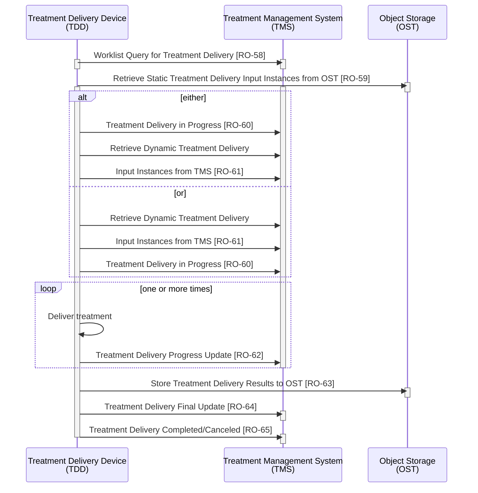
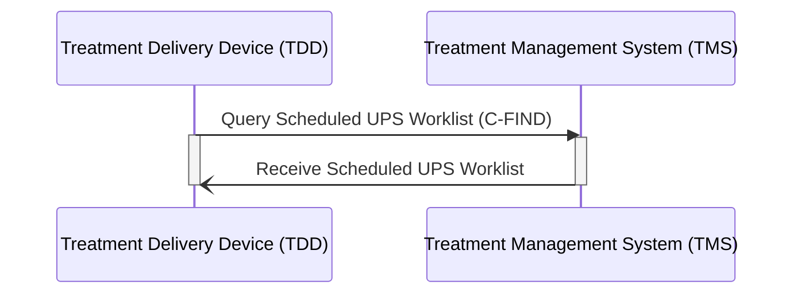
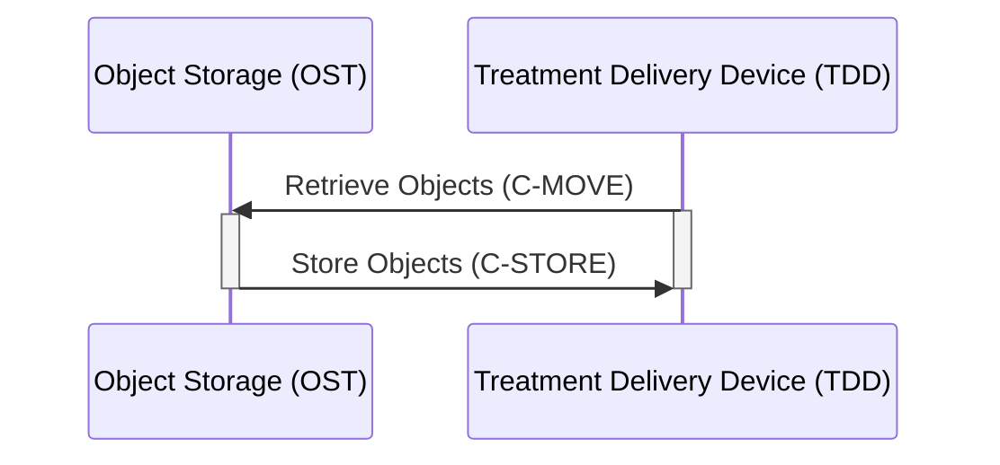
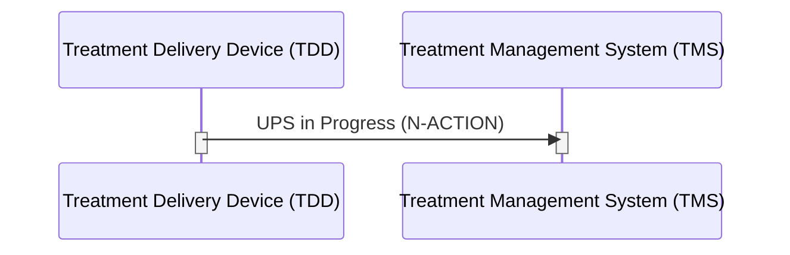

# tdwii_plus_examples
Working Python sample code for performing various transactions within the IHE-RO TDW-II profile, as well as extensions based on UPS Watch and UPS Event
No claims are being made that any of the sample code is adherent to the profile,
but the examples that are not UPS Watch/UPS Event should interact successfully within limits with valid TDW-II actors.

While the command lines shown below are run via python as the command, they are now all executable scripts (`chmod +x`) so they can be run directly on *nix platforms (you still need to have Python in your environment).
The samples are in the `tdwii_plus_examples` subdirectory.

> [!NOTE]
> The version of Python used for development is 3.10 

# Basic Process Flow in TDW-II Profile
> This diagram is based on: https://www.ihe.net/uploadedFiles/Documents/Radiation_Oncology/IHE_RO_Suppl_TDW_II.pdf <br>
> IHE Radiation Oncology Technical Framework Supplement<br>
> Treatment Delivery Workflow-II (TDW-II)<br>
> Rev. 1.1 – Trial Implementation




# Installation
Poetry (https://python-poetry.org/) is used for package management.

Assuming you have already cloned the repository (or downloaded a compressed archive of it) and are in the top level directory for the project
```shell
poetry install
```
To confirm the required packages are installed
```shell
python -m pip list
```
> [!TIP]
> If the required packages are not shown (e.g. pydicom, pynetdicom), you may have an interaction issue between poetry and pyenv.
> Try:
> ```shell
> export VIRTUAL_ENV=$(pyenv virtualenv-prefix)/envs/$(pyenv version | cut -f1 -d ' ')
> poetry install
> ``` 


# Usage & Sample Workflow

The sample queries and responses are not necessarily coordinated with an OST (yet), i.e. using an appropriate AE Title

Application entity information now in a configuration file

Text files in dcmdump format for various queries.

## dcmdump and dump2dcm
`dcmdump` and `dump2dcm` are in DCMTK, typically available on:

Linux using:
```shell
sudo apt install dcmtk
```
or MacOS using:
```shell
brew install dcmtk
```
To generate `.dcm` files needed by UPS enabled findscu
```shell
dump2dcm queryfile.dcmdump.txt queryfile.dcm
```


## [RO-58] A sample C-FIND SCU is available from pynetdicom (it has been enhanced with support for UPS)



clone latest **pynetdicom** (it supports argument `--ups`) from https://github.com/pydicom/pynetdicom ,

then use `findscu` to query the TMS (Treatment Management System):

in `pynetdicom/apps/`

```shell
python findscu.py -w --ups -f UPSCFind_TDWII_SCHEDULED_FX1.dcm 10.211.55.8 10401
```
Arguments:
* `-w`: use modality worklist information model
* `--ups`: use unified procedure step pull information model
* `-f UPSCFind_TDWII_SCHEDULED_FX1.dcm`: use a DICOM file as the query dataset
* `10.211.55.8 10401`: DICOM peer and port number of the SCP (e.g. TMS)

Assuming the TMS has a session scheduled for machine **FX1**, this should result in a response file
`rsp000001.dcm`

use that response to drive a C-MOVE-RQ in the following section:


## [RO-59] A script that will issue a C-MOVE-RQ for the referenced inputs in the previous response



The following will send the C-MOVE-RQ to the AE Title listed (in the C-FIND-RSP e.g. in the rsp000001.dcm file above) for a given input information sequence item and specify PPVS_SCP as the destination for the move
```shell
python cmove_inputs.py PPVS_SCP ../../pynetdicom/pynetdicom/apps/findscu/rsp000001.dcm
```

Note that the IP Address and Port information for a given Application Entity (e.g. **PPVS_SCP** as shown above) must be configured in the `ApplicationEntities.json` file (in the current working directory, so you will need to copy it from the top level and modify to have your AEs).


## A sample N-CREATE SCU that will read in a UPS Push SOP and transmit that to a UPS SCP (e.g. TMS Simulator)
A previous response to findscu can be used for simulation purposes but the Procedure Step State must be **SCHEDULED**
```shell
python ncreatescu.py addr port path
```
Arguments:
* `addr port`: DICOM peer and port number of the SCP (e.g. TMS)
* `path`: use a DICOM file or folder to be transmitted to SCP


## A TMS Simulator (of limited capability) is provided in upsscp.py:
in `tdwii_plus_examples/`
```shell
python upsscp.py --debug
```
The default configuration (`upsscp_default.ini`) will specify a ups_instances directory that upsscp will use to store UPS Push SOP instance it received from the ncreatescu and it will provide those in response to queries that match them.

The default configuration listens on port `11114`

Matching/filtering is currently based only on:
* Scheduled Station Name (machine name)
* Procedure Step State
* Scheduled Procedure Step Start DateTime
* Scheduled Workitem Code Sequence (the Code Value)

```python
ds.ScheduledStationNameCodeSequence[0].CodeValue
ds.ProcedureStepState
ds.ScheduledProcedureStepStartDateTime
ds.ScheduledWorkitemCodeSequence[0].CodeValue
```

A sample response is in `tdwii_plus_examples/responses/dcm/` and it can be renamed and then transmitted to upsscp via ncreatescu

Alternative/additional sample responses can be constructed by using dcmdump on the provided sample response, editing the text, and using dump2dcm.


So one could test without having a real TMS:
```shell
python findscu.py -w --ups -f UPSCFind_TDWII_SCHEDULED_FX1.dcm 127.0.0.1 11114
```


## A sample UPS Watch SCU (for subscribing for UPS Event/notification) is provided in watchscu.py
```shell
python watchscu.py 127.0.0.1 11114
```
the above will attempt to perform a Global Subscription to upsscp (e.g. TMS)


## A sample UPS NACTION SCU (for changing Procedure Step Status for UPS) is provided in nactionscu.py



```shell
python nactionscu.py -T "1.2.826.0.1.3680043.8.498.23133079088775253446636289730969872574" -R "IN PROGRESS" 127.0.0.1 11114 1.2.840.113854.19.4.2017747596206021632.638223481578481915
```
the above will request that upsscp (listening at 11114) change the state using the **Transaction UID** (-T) of the UPS with the shown UID to "IN PROGRESS"

While the Transaction UID argument is optional here (one will be generated internally), if you don't know the Transaction UID, you can't perform further changes.

```shell
python nactionscu.py -T "1.2.826.0.1.3680043.8.498.23133079088775253446636289730969872574" -R "COMPLETED" 127.0.0.1 11114 1.2.840.113854.19.4.2017747596206021632.638223481578481915
```
the above will request that upsscp (listening at 11114) change the state using the **Transaction UID** (-T) of the UPS with the shown UID to "COMPLETED".  The Transaction UID here is **not** optional.

## A sample application for receiving notifications (N-EVENT-REPORT-RQ) is provided in nevent_receiver.py
```shell
python nevent_receiver.py --debug
```
which listens on port `11115` by default (`nevent_receiver_default.ini`),

The application does not take specific actions when receiving an N-EVENT-REPORT (but it will log in response)


## A sample application for sending notifications is provided in nevent_sender.py (which can be run against nevent_receiver.py mentioned above)
```shell
python nevent_sender.py 127.0.0.1 11115
```


## A Qt/PySide6 based utility for generating RT Beams Delivery Instructions and Unified Procedure Step content
```shell
cd rtbdi_creator
python mainbdiwidget.py 
```

## A Qt/PySide6 based example of a Patient Position Verification System that subscribes to UPS Events and responds by querying for the UPS information, requesting (C-MOVE) the referenced information objects, etc.
```shell
cd TDWII_PPVS_Subscriber
python ppvs_subscriber_widget.py 
```

## The OST can be simulated using the pynetdicom qrscp application.

The remaining intent (now that a PPVS Simulator is included) is to eventually integrate the various functionality as appropriate in to a TMS Simulator (and perhaps eventually a TDS Simulator).

But the purpose of the examples is to provide working sample code for individual TDW-II Transactions and for UPW Watch/UPS Event capabilities that can be used to extend a TDW-II environment so that it is event aware/event driven.


# Abbreviations
| Abbr. | Description |
|-------| ------------|
| TDW   | Treatment Delivery Workflow |
| UPS   | Unified Procedure Step |
| TMS   | Treatment Management System |
| TDS   | Treatment Delivery System |
| TDD   | Treatment Delivery Device |
| IPDW  | Integrated Positioning and Delivery Workflow |
| PPVS  | Patient Position Verification System |
| OST   | Object Storage |
